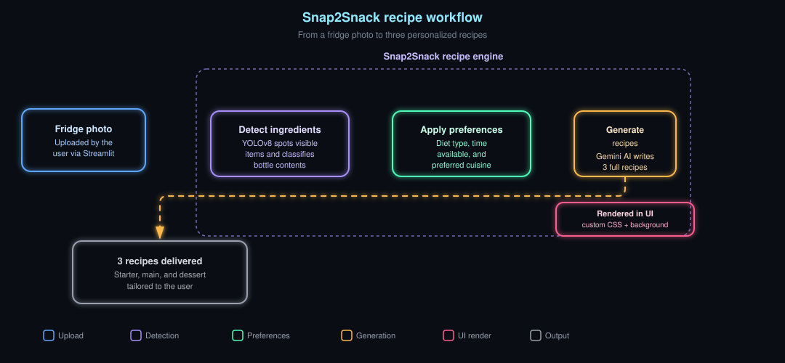

# 🥗 Snap2Snack

**Snap2Snack** is a Streamlit-based AI web app that helps you turn fridge photos into delicious, personalized recipes. Upload an image of your fridge, detect ingredients using YOLOv8, and let Gemini AI suggest recipes tailored to your dietary preferences, time constraints, and cuisine cravings.

---

## 🚀 Features

- 📸 Upload a photo of your fridge
- 🧠 Detect ingredients using YOLOv8 object detection
- 🧪 Classify bottle contents (e.g., juice, milk, sauce)
- 🍽️ Generate 3 full recipes using Gemini AI based on:
  - Diet type (Vegetarian, Vegan, Keto, etc.)
  - Time available
  - Preferred cuisine
- 🎨 Beautiful UI with custom CSS and Unsplash background

---

## 🛠️ Installation

Make sure you have Python 3.8+ and pip installed. Then run the following commands:

```bash
pip install streamlit -q
pip install ultralytics opencv-python pillow google-generativeai torch torchvision pyngrok
```

You’ll also need to install and configure Cloudflare’s tunneling tool for public access:

```bash
wget -q -O cloudflared.deb https://github.com/cloudflare/cloudflared/releases/latest/download/cloudflared-linux-amd64.deb
sudo dpkg -i cloudflared.deb
```

---

## 🔑 Gemini API Key

To use Gemini for recipe generation, set your API key in `app.py`:

```python
genai.configure(api_key="Your API Key")
```

You can get your API key from [Google AI Studio](https://makersuite.google.com/app).

---

## 📂 File Structure

```
.
├── app.py               # Main Streamlit app
├── requirements.txt     # Optional: list of dependencies
└── README.md            # You're reading it!
```

---

## ▶️ Running the App

To launch the app locally:

```bash
streamlit run app.py
```

To expose it publicly using Cloudflare:

```bash
nohup streamlit run app.py --server.port 8501 &>/content/logs.txt &
cloudflared tunnel --url http://localhost:8501 --no-autoupdate
```

---
## Architecture


## 🧠 How It Works

1. **Upload Image**: You upload a fridge photo.
2. **Detect Ingredients**: YOLOv8 detects visible items.
3. **Classify Bottles**: Heuristics determine bottle contents.
4. **Generate Recipes**: Gemini AI crafts 3 recipes based on your selections.

---

## 📸 Example Use Case

- Upload a fridge image with tomatoes, bell peppers, and a bottle of milk.
- Select: Vegetarian, 30 minutes, Italian.
- Get back:
  - 🥗 Starter: "Pomodoro Bruschetta"
  - 🍝 Main: "Creamy Bell Pepper Pasta"
  - 🍨 Dessert: "Milk Panna Cotta"

---

## 💡 Tips

- Use clear, well-lit images for better detection.
- Gemini may creatively interpret unknown items—check outputs for realism.
- You can tweak the prompt in `app.py` to refine recipe style.

